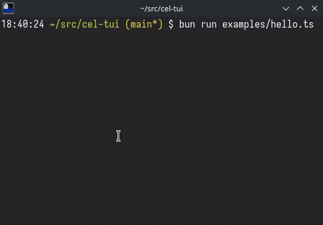

# cel-tui

A TypeScript TUI framework built around a declarative functional API and ultra-fast rendering.

<p align="center">
  <picture>
    
  </picture>
</p>

## Why "cel"?

A **cel** is the smallest unit of a terminal display — a single character cell. Start from the smallest meaningful unit and build up, with nothing wasted.

## Quick Example

```ts
import { cel, VStack, Text, TextInput, ProcessTerminal } from "@cel-tui/core";

let input = "";

cel.init(new ProcessTerminal());
cel.viewport(() =>
  VStack(
    {
      height: "100%",
      onKeyPress: (key) => {
        if (key === "ctrl+q") {
          cel.stop();
          process.exit();
        }
      },
    },
    [
      Text("Hello, cel-tui!", { bold: true, fgColor: "color06" }),
      Text("─", { repeat: "fill", fgColor: "color08" }),
      TextInput({
        flex: 1,
        value: input,
        onChange: (v) => {
          input = v;
          cel.render();
        },
      }),
    ],
  ),
);
```

## Primitives

| Primitive                 | Description                        |
| ------------------------- | ---------------------------------- |
| `VStack(props, children)` | Vertical stack — top to bottom     |
| `HStack(props, children)` | Horizontal stack — left to right   |
| `Text(content, props?)`   | Styled text leaf                   |
| `TextInput(props)`        | Multi-line editable text container |

## Key Concepts

- **State is external** — the framework renders what you give it. Use any state approach.
- **`cel.viewport(() => tree)`** sets the render function, **`cel.render()`** triggers re-renders.
- **Flexbox layout** — fixed, flex, percentage, and intrinsic sizing with gap, padding, alignment.
- **Layers** — return an array for multi-layer compositing (modals, overlays).
- **Uncontrolled by default** — focus and scroll just work. Opt into controlled mode when needed.
- **Style inheritance** — containers propagate styles to descendants. `bgColor` fills the rect.
- **16-color palette** — numbered slots (`"color00"`–`"color15"`) mapped to ANSI 16 by default. Custom themes can remap to 256-color or true color.
- **Cell buffer rendering** — styled cells, differential updates, synchronized output.
- **Kitty keyboard protocol** — unambiguous key input with full modifier support. Requires a [compatible terminal](https://sw.kovidgoyal.net/kitty/keyboard-protocol/#progressive-enhancement) (Kitty, WezTerm, Ghostty, foot, Alacritty, Windows Terminal).

## Packages

| Package               | Description                                                               |
| --------------------- | ------------------------------------------------------------------------- |
| `@cel-tui/types`      | Shared type definitions                                                   |
| `@cel-tui/core`       | Framework engine and primitives                                           |
| `@cel-tui/components` | Pre-made components (Button, Spacer, Divider, VDivider, Select, Markdown) |

## Documentation

- **[API Reference](https://sacenox.github.io/cel-tui/)** — full TypeDoc-generated docs on GitHub Pages
- **[Specification](spec.md)** — complete design spec covering layout, rendering, input, and focus
- **[Agent Skill](docs/skill/cel-tui/SKILL.md)** — structured guide for AI coding agents to build apps with cel-tui

## Performance

cel-tui ships a [benchmark suite](benchmarks/) covering every pipeline stage (layout, paint, cell buffer, ANSI emission, hit testing, key parsing). On a comparable tree, the full end-to-end render completes in **~65 µs** — around 15,000 renders/sec. See [benchmarks/RESULTS.md](benchmarks/RESULTS.md) for detailed numbers and an Ink comparison.

```bash
bun run bench         # run all benchmarks
```

## Development

```bash
bun install           # install dependencies
bun test              # run tests
bun run bench         # run benchmarks
bun run check         # biome lint
bun run format        # prettier check
bun run typecheck     # tsc --noEmit
bun run docs          # generate API docs
```

## License

MIT
